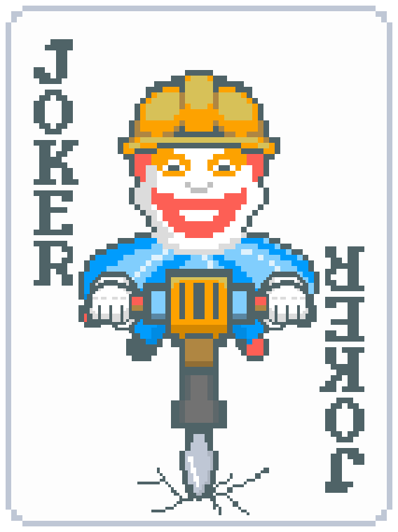

<div align="center">
  <h1>Jackhammer</h1>
  <div></div>
  <em>Heavy machinery for a card game.</em>
</div>

<br/>

Jackhammer is a small, reproducible benchmark for Balatro agents. It runs agents on the same
published seeds, pins the exact [Jackdaw](https://github.com/TylerFlar/jackdaw-balatro) simulator
commit, joins results by seed, and reports uncertainty. It is a referee, not a claim that these are
strong agents or that Jackdaw is identical to live Balatro.

The useful loop is deliberately short:

```text
install -> run a baseline -> add an agent -> compare on identical seeds -> inspect failures
```

## The baselines

| Display name | Stable agent ID | What it does | Mean highest ante |
|---|---|---|---:|
| Random Legal | `random-legal` | Samples a legal action type uniformly, then a legal target; no tactical layer | 1.000 |
| Random Shop | `random-shop` | `GreedyTactical` card play; random legal shop actions | 1.637 |
| Cheapest-Joker Shop | `greedy-shop` | `GreedyTactical` card play; buys the cheapest affordable Joker | 3.204 |

Those are the complete 240-seed v2 results on the `idIing/jackdaw-balatro` fork of Jackdaw at
[`4d6f19d`](https://github.com/idIing/jackdaw-balatro/commit/4d6f19d9fe73f96603412a59ad5eab16d08937e7),
the exact commit the lockfile installs; all three went 0/240 on wins. The stable ID `greedy-shop`
predates the clearer display name and is retained so existing artifacts stay comparable. The paired
Random Shop -> Cheapest-Joker Shop difference is +1.567 ante with a bootstrap-95 interval of
`[+1.400, +1.729]`.

### The shared card play: `GreedyTactical`

**`random-shop` and `greedy-shop` both play their cards with `GreedyTactical`**
(`src/playground/harness.py`) and differ only in what they do in the shop. In one sentence: on
every play decision it exact-scores up to 300 legal card subsets, plays the best hand if that
clears the blind, and otherwise discards to dig for a better one.

Holding it fixed is the point — it plays every hand both agents play, so the paired difference
between them is a shop-policy contrast, not two different card players. `random-legal` does not use
it at all, which is what makes it an honest floor rather than a third variation on the same player.

The 300 cap is exhaustive for a standard 8-card hand, where the complete set of ≤5-card subsets is
218. Above 8 cards it truncates, and it drops the largest subsets first. It also does not bind
equally on the two arms: shopping grows the hand, so `greedy-shop` truncates ~2.4x as often, and the
`+1.567` understates the contrast by about 0.1 ante — see [known limits](docs/known-limits.md).

This ladder is intentionally weak. `greedy-shop` does not understand Joker text, quality, rarity,
or synergy; it never rerolls or sells and it does not buy vouchers or consumables. That gap is an
open contribution surface, not something hidden behind a flattering name.

## Install

Prerequisites: Git and [uv](https://docs.astral.sh/uv/). Python 3.12 and the exact simulator source
are resolved by the lockfile.

```bash
git clone https://github.com/idIing/jackhammer.git
cd jackhammer
uv sync --locked
uv run python scripts/evaluate.py --list
```

Expected list output:

```text
  greedy-shop      Buys the cheapest affordable joker; fixed greedy tactics; never skips a blind, never uses a consumable before cash-out.
  random-legal     Uniformly-random legal action in every phase, including skipping blinds and using consumables before cash-out. The floor.
  random-shop      Uniformly-random legal shop action; fixed greedy tactics; never skips a blind, never uses a consumable before cash-out.
```

## Run the benchmark

A quick smoke run takes only the first eight public training seeds:

```bash
uv run python scripts/evaluate.py \
  --agent greedy-shop --vs random-shop --limit 8 --workers 4
```

Remove `--limit 8` for the reportable v1 comparison over all 240 seeds. The command writes raw
JSONL decision records, one result artifact per arm, and a paired comparison under `data/bench/`.
The reportable run prints (artifact paths omitted here):

```text
greedy-shop: 240 runs
  mean highest ante: 3.204
random-shop: 240 runs
  mean highest ante: 1.637
paired (240 seeds): greedy-shop - random-shop = +1.567 ante [+1.400, +1.729] boot-95
  interval excludes zero
```

See [the frozen protocol](docs/protocol-v2.md) for what that claim means and
[the artifact contract](docs/result-artifacts.md) for the machine-readable output.

## Inspect a failure

```bash
uv run python scripts/inspect_run.py data/bench/greedy-shop.jsonl --worst
uv run python scripts/inspect_run.py data/bench/greedy-shop.jsonl --seed PVRQ4K5A
```

The viewer prints the selected run's outcome, final resources, Jokers, and decision timeline. It
does not require the game client.

## Add an agent

The public interface is `AgentSpec(name, description, make_decider)`. A decider receives the live
environment once per seed and returns a function that selects factored legal actions. Start with
[the agent-porting guide](docs/adding-an-agent.md), register a new stable name, then compare it to
the closest baseline with `--vs`.

## Add a seed dataset

Protocol v2 always means the committed 240-seed `train` split. New coverage, stress, curriculum, or
seed-difficulty questions belong in versioned sidecar manifests:

```bash
uv run python scripts/evaluate.py \
  --agent greedy-shop \
  --dataset examples/datasets/coverage-example.json \
  --split sample
```

Custom datasets are stamped as `jackhammer/dataset-eval/v2`, never `jackhammer/v2`. That makes
future questions such as “how does seed coverage affect measured agent strength?” additive without
silently moving the headline benchmark. See [Adding datasets](docs/datasets.md).

## Contributing

Read [CONTRIBUTING.md](CONTRIBUTING.md) and the project's [known limits](docs/known-limits.md).
The short version: preserve benchmark meaning, pair
comparisons on identical seeds, report uncertainty, and describe simulator-only evidence as
simulator-only evidence.

Jackhammer is MIT licensed. Balatro is by LocalThunk/Playstack; this project is unaffiliated and
does not distribute game assets or source.
